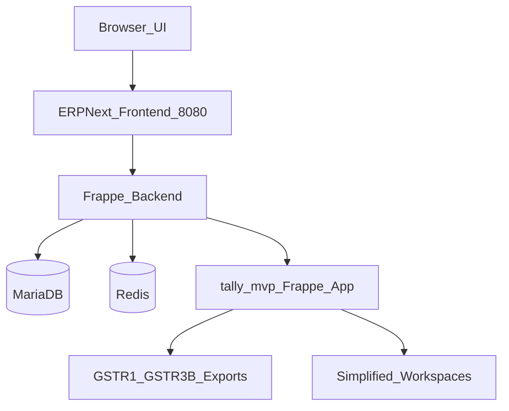

# Tally MVP — Web App (ERPNext Extension)

Browser-based MVP for Indian SMB accounting, built on **ERPNext v16** with a custom **Tally MVP** Frappe app for simplified UX, GST exports, and role-based navigation.

## Quick start

```bash
cd tally-mvp
cp docker/.env.example docker/.env
make up          # start ERPNext stack on http://localhost:8080
make setup       # install tally_mvp app + India GST config (after first boot)
```

**Default login:** `Administrator` / `admin`

## What's included

| Area | Location |
|---|---|
| Platform decision (ERPNext + self-hosted) | [docs/01-platform-decision.md](docs/01-platform-decision.md) |
| Discovery: workflows, GST, reports | [docs/02-discovery-workflows.md](docs/02-discovery-workflows.md) |
| Chart of accounts template | [docs/03-chart-of-accounts.md](docs/03-chart-of-accounts.md) |
| MVP report list | [docs/04-mvp-report-list.md](docs/04-mvp-report-list.md) |
| UAT checklist | [docs/05-uat-checklist.md](docs/05-uat-checklist.md) |
| Training guide | [docs/06-training-guide.md](docs/06-training-guide.md) |
| Go-live runbook | [docs/07-golive-runbook.md](docs/07-golive-runbook.md) |
| Docker / ERPNext stack | [docker/](docker/) |
| Custom Frappe app | [frappe_app/tally_mvp/](frappe_app/tally_mvp/) |
| Migration scripts | [scripts/](scripts/) |
| Sample CSV data | [data/](data/) |

## MVP scope

- Company setup, chart of accounts, ledgers
- GST sales/purchase invoicing
- Payment receipts, receivables/payables
- Basic inventory (items, warehouses, stock in/out)
- GSTR-1 / GSTR-3B export reports
- Trial Balance, P&L, Balance Sheet
- Roles: Owner, Accountant, Storekeeper

## Make targets

```bash
make up          # start ERPNext (port 8080)
make down        # stop stack
make logs        # follow logs
make setup       # install tally_mvp + configure India GST
make migrate     # run opening balance / master migration scripts
make seed        # load demo data for UAT
```

## Architecture


