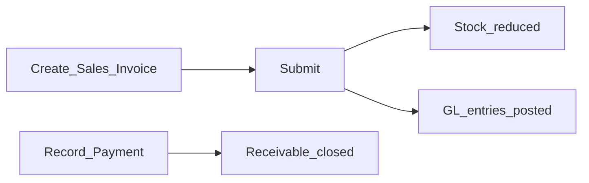

# Discovery: Tally-Like Workflows & GST Configuration

**Workshop duration:** 2 weeks (condensed reference for MVP)  
**Target users:** Indian SMB — retail, trading, small manufacturing

## User personas

| Persona | Role in ERPNext | Primary tasks |
|---|---|---|
| Business Owner | Tally Owner | Dashboard, invoices, payments, reports |
| Accountant | Tally Accountant | Vouchers, GST returns, reconciliation |
| Storekeeper | Tally Storekeeper | Items, stock in/out, delivery notes |

## Core voucher mapping (Tally → ERPNext)

| Tally voucher | ERPNext document | MVP priority |
|---|---|---|
| Sales Invoice | Sales Invoice | P0 |
| Purchase Invoice | Purchase Invoice | P0 |
| Receipt | Payment Entry (Receive) | P0 |
| Payment | Payment Entry (Pay) | P0 |
| Credit Note | Sales Invoice (is_return) | P1 |
| Debit Note | Purchase Invoice (is_return) | P1 |
| Stock Journal | Stock Entry | P0 |
| Delivery Note | Delivery Note | P0 |
| Receipt Note | Purchase Receipt | P0 |

## Daily workflow (retail/trading)

1. **Morning:** Check dashboard — dues, cash, low stock
2. **Sales:** Create GST invoice → print/share PDF
3. **Purchases:** Record purchase invoice + goods receipt
4. **Payments:** Record customer receipts and vendor payments
5. **Month-end:** Export GSTR-1 / GSTR-3B, run P&L and Balance Sheet

## GST configuration (MVP)

| Setting | MVP value | Notes |
|---|---|---|
| Registration type | Regular (default) | Composition scheme deferred to v2 |
| GSTIN | Per company | Required on invoices |
| HSN/SAC | On all items | 4/6/8 digit as applicable |
| Tax template | CGST+SGST (intra-state), IGST (inter-state) | Auto from company + party state |
| E-invoice | Off in MVP | Enable in v2 with NIC API |
| GSTR filing | Export only | Manual upload to GST portal |

## Company features enabled (F11 equivalent)

- Accounting: bill-wise receivables/payables
- Inventory: multi-warehouse, batch optional
- Statutory: GST India
- Payroll: **disabled** in MVP

## MVP acceptance criteria

- [ ] Owner can create and submit a GST sales invoice in under 2 minutes
- [ ] Stock quantity updates on invoice submission
- [ ] Payment entry clears outstanding invoice
- [ ] GSTR-1 export matches submitted invoices for the period
- [ ] Trial Balance debits = credits
- [ ] Three roles see only their workspace modules
