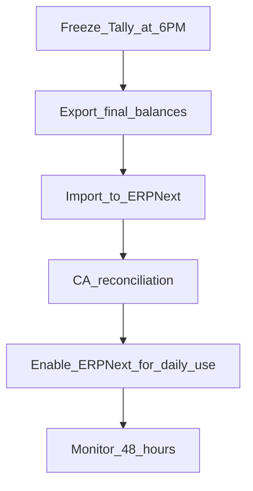

# Go-Live Runbook

**Target:** Production cutover after successful UAT and parallel run

## Pre-go-live (T-14 to T-1)

### T-14 days
- [ ] Freeze MVP scope — no new features
- [ ] Complete UAT checklist with CA sign-off
- [ ] Begin parallel run with live Tally/Excel

### T-7 days
- [ ] Export final masters from Tally (customers, suppliers, items)
- [ ] Prepare opening balance CSV (see `data/sample_opening_balances.csv`)
- [ ] Provision production VPS (8 GB RAM, 80 GB disk)
- [ ] Configure domain + SSL

### T-3 days
- [ ] Deploy production stack (`docker/docker-compose.yml` on VPS)
- [ ] Run `make setup` on production site
- [ ] Import masters: `make migrate`
- [ ] Import opening balances
- [ ] CA reconciles opening TB with Tally

### T-1 day
- [ ] Train all users (see [training guide](06-training-guide.md))
- [ ] Verify backups (MariaDB dump + sites volume)
- [ ] Communicate cutover window to staff

## Go-live day (T-0)



| Time | Action | Owner |
|---|---|---|
| 18:00 | Stop new entries in Tally | Owner |
| 18:30 | Export closing balances + stock | Accountant |
| 19:00 | Import to ERPNext (`make migrate`) | Tech |
| 20:00 | CA verifies Trial Balance = Tally | CA |
| 21:00 | Go-live announcement | Owner |
| Next day | All new transactions in ERPNext only | All users |

## Post-go-live stabilization (weeks 1–6)

### Week 1
- Daily standup: blockers, voucher errors
- Hot-fix priority: GST calculation, stock posting, payment linking
- Monitor `make logs` for worker/scheduler errors

### Weeks 2–4
- Edge cases: credit notes, returns, round-off differences
- Report tweaks per CA feedback
- Performance: slow reports → add date filters

### Weeks 5–6
- Close stabilization; document known limitations
- Plan v2: e-invoice API, payroll, connected banking

## Rollback plan

If critical failure within 48 hours:

1. Re-enable Tally for daily entry
2. Export ERPNext transactions created since cutover
3. Manually re-enter in Tally (or keep ERPNext as secondary until fixed)
4. Root-cause analysis before second cutover attempt

## Production backup schedule

```bash
# Daily at 02:00 — add to crontab on VPS
docker compose -f docker/docker-compose.yml exec -T db \
  mysqldump -u root -p"$MYSQL_ROOT_PASSWORD" --all-databases \
  > /backups/erpnext-$(date +%Y%m%d).sql
```

Retain 30 daily + 12 monthly backups.

## Success metrics (30 days post go-live)

| Metric | Target |
|---|---|
| Invoices created in ERPNext | 100% of new transactions |
| GST export accuracy | CA approves without manual correction |
| User adoption | All 3 roles active weekly |
| Critical bugs | Zero open P0 after week 2 |
| Parallel Tally usage | Stopped by day 7 |
